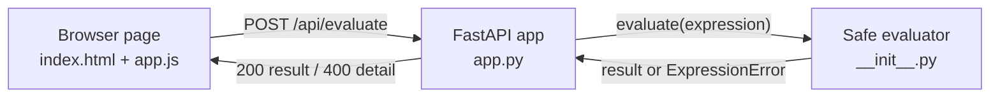

# Architecture

The browser calculator is one static page and one HTTP service. The page holds no arithmetic logic. It collects a string from the buttons or the keyboard, sends the string to the server, and shows the number the server returns.

The server owns the evaluator. `evaluate` parses the expression with Python's `ast` module and walks the tree through a dispatch table. Only number constants, the binary operators `+ - * / % **`, and unary `+` and `-` are in the table. Any other node is rejected before it can run, so the endpoint never executes arbitrary code.

## Boundaries

- The HTTP request is the trust boundary. `EvaluateRequest` validates that the field exists and is at most 200 characters before the evaluator runs.
- The evaluator is pure. It takes a string and returns a float or raises `ExpressionError`, with no state and no I/O.
- The container runs as a non-root user and exposes `GET /healthz` for the health check.
