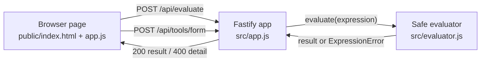

# Architecture

The browser calculator is one static page and one HTTP service. The page holds no arithmetic logic. It collects a string from the buttons or the keyboard, sends the string to the server, and shows the number the server returns. The page also posts a contact form to the server.

The server owns the evaluator. `evaluate` tokenizes the expression and parses it with recursive descent. Only number literals, the binary operators `+ - * / % **`, and unary `+` and `-` are accepted, along with parentheses. Any other character or shape is rejected before it can run, so the endpoint never executes arbitrary code.

## Boundaries

- The HTTP request is the trust boundary. The route body schema validates that `expression` exists and is at most 200 characters before the evaluator runs.
- The evaluator is pure. It takes a string and returns a number or throws `ExpressionError`, with no state and no I/O.
- The form route is stateless. It validates the payload and returns the values with an acknowledgement; it writes nothing.
- The OpenAPI document is generated from the route schemas by `scripts/write-openapi.mjs`, so the checked-in `docs/openapi.json` cannot drift from the code.
- The container runs as a non-root user and exposes `GET /healthz` for the health check.
